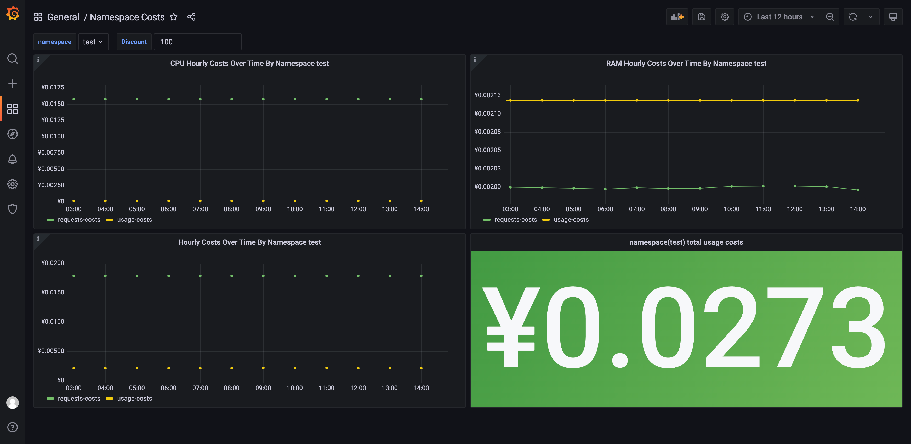
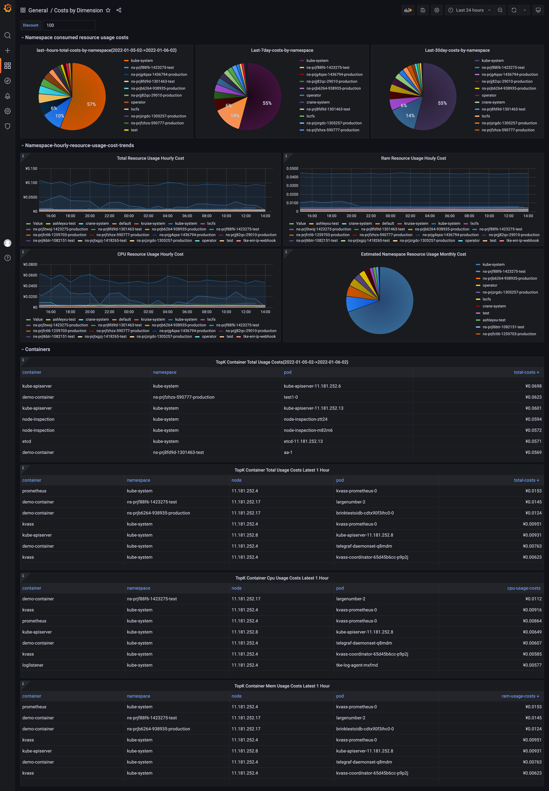

# Fadvisor: FinOps Advisor

[](https://goreportcard.com/report/github.com/gocrane/fadvisor)
[](https://godoc.org/github.com/gocrane/fadvisor)
[](https://www.apache.org/licenses/LICENSE-2.0.html)


---

Fadvisor(FinOps Advisor) provides capability of `FinOps Observalibility`, it can be integrated with Crane to help users to improve the `cost visualization` and `cost optimization`. Also, it can be integrated with your monitoring system as a metric exporter.


Fadvisor has a collection of exporters to collect metrics about cost and other metrics. 

 - `exporters` collects metrics guided by `FinOps`.
   - now a cost-exporter is available, and other exporters can be integrated
 - `apiserver` aggregates collected data and calculates cloud cost based on usage and price  
 
# Concept
Fadvisor Cost model provides a way to estimate and breakdown the resource price of each container, pod, or other resources in kubernetes. Then, users can have cost insight by viewing cost grouped by labels or other dimensions.

Please note that Cost model is to **estimate cost**, not to replace the billing, because real billing depends on the billing system.

Cost model is an implementation of the cost allocation and showback & chargeback from the FinOps.
	  
	1. The simplest cost model is to estimate a resource price of all nodes or pods by the same price.
	   For example, when compute costs, you can assume all container's cpu & ram unit price is the same, 2$ Core/Hour, 0.3$ Gib/Hour

	2. Advanced cost model is to estimate a resource price by cost breakdown.
	   This theory is based on that price of each cloud machine instance with different instance type and charge type is different.
	   So the containers price in different node type is different.

# Tutorial
Fadvisor is a metrics exporter which collects cloud instance price information by calling Cloud Billing API and exports the price information as metrics. 
Any cloud provider can implement the API and Crane will work for the specific Cloud, Tencent Cloud is supported in current release.

## PreRequests
Install Prometheus
```
helm repo add prometheus-community https://prometheus-community.github.io/helm-charts
helm install prometheus -n crane-system --set pushgateway.enabled=false --set alertmanager.enabled=false --set server.persistentVolume.enabled=false -f https://raw.githubusercontent.com/gocrane/helm-charts/main/integration/prometheus/override_values.yaml --create-namespace  prometheus-community/prometheus

```
Install Grafana
```
helm repo add grafana https://grafana.github.io/helm-charts
helm install grafana -f https://raw.githubusercontent.com/gocrane/helm-charts/main/integration/grafana/override_values.yaml -n crane-system --create-namespace grafana/grafana
```

## Deploy fadvisor 
### Deploy on local
Install on local such as mac desktop, it will use default config. you can also deploy on cloud by this way, but it will use default config.

```
helm repo add crane https://gocrane.github.io/helm-charts
helm install fadvisor -n crane-system --create-namespace crane/fadvisor
```

### Deploy on cloud
If you deploy fadvisor on cloud, now it support tencent cloud. you need provide a qcloud config file which include cloud credentials as following, make sure you specify your `clusterId`,`secretId`,`secretKey`,`region`

```
[credentials]
clusterId={your cluster id}
appId=app1
secretId={your cloud provider credential secret id}
secretKey={your cloud provider credential secret key}
[clientProfile]
defaultLimit=100
defaultLanguage=zh-CN
defaultTimeoutSeconds=10
region={your cluster region, such as ap-beijing、ap-shanghai、ap-guangzhou、ap-shenzhen and so on, you can find region name in your cloud provider console}
domainSuffix=internal.tencentcloudapi.com
scheme=
```
then execute following commands, suppose your config file name is qcloud-config.ini in your current directory:
```
helm repo add crane https://gocrane.github.io/helm-charts
helm install fadvisor --set-file cloudConfigFile=qcloud-config.ini --set extraArgs.provider=qcloud  -n crane-system --create-namespace crane/fadvisor
```
Except Fadvisor, it will install following components in your system by default.

 - kube-state-metrics
 - node-exporter
 - prometheus
 - grafana


## Integrated with existing monitoring components
If you have Prometheus and Grafana installed, you can just deploy fadvisor and change related configuration.

You can deploy the fadvisor to your tke cluster to collect the metric, use prometheus to scrape the metric, and following dashboards can be used;

### 1. Deploy fadvisor
#### Install by helm
```
helm repo add crane https://gocrane.github.io/helm-charts
helm install fadvisor -n crane-system --create-namespace crane/fadvisor
```

#### Install by kubectl
**NOTE**  you must specify your k8s secret id and secret key in `config` file, this is used to access Tencent Cloud Cvm API.

```
[credentials]
clusterId={your cluster id}
appId=app1
secretId={your cloud provider credential secret id}
secretKey={your cloud provider credential secret key}
[clientProfile]
defaultLimit=100
defaultLanguage=zh-CN
defaultTimeoutSeconds=10
region={your cluster region, such as ap-beijing、ap-shanghai、ap-guangzhou、ap-shenzhen and so on, you can find region name in your cloud provider console}
domainSuffix=internal.tencentcloudapi.com
scheme=
```
then execute `cat config | base64`, paste the secret to following secret.yaml's config.
```
apiVersion: v1
kind: Secret
metadata:
  name: fadvisor
data:
  config: W2NyZWRlbnRpYWxzXQpjbHVzdGVySWQ9Y2x1c3RlcjEKYXBwSWQ9YXBwMQpzZWNyZXRJZD1pZDEKc2VjcmV0S2V5PWtleTEKW2NsaWVudFByb2ZpbGVdCmRlYnVnPXRydWUKZGVmYXVsdExpbWl0PTEKZGVmYXVsdExhbmd1YWdlPUNICmRlZmF1bHRUaW1lb3V0U2Vjb25kcz0xMApyZWdpb249c2hhbmdoYWkKZG9tYWluU3VmZml4PWNsb3VkLnRlbmNlbnQuY29tCnNjaGVtZT1odHRwCg==
```
then deploy by kubectl.
```
kubectl create -f deploy/fadvisor/ -n crane-system
```

### 2. Configure the prometheus scrape config and rules
Configure following scrape target to your prometheus. 

```
- job_name: "fadvisor"
    honor_timestamps: true
    scrape_interval: 5m
    scheme: http
    metrics_path: /metrics
    static_configs:
      - targets: ['fadvisor.crane-system.svc.cluster.local:8081']
```
**NOTE**, except cost-exporter, your prometheus must have scraped the kubernetes metrics including:
 - `kubelet-cadvisor` metrics.
 - `node-exporter` metrics. need to install node-exporter.
 - `kube-state-metrics` metrics. need to install kube-state-metrics.


Configure some recording rules to your prometheus.
```
recording_rules.yml:
  groups:
    - name: costs.rules
      interval: 3600s
      rules:
        - expr: |
            sum(label_replace(irate(container_cpu_usage_seconds_total{container!="POD", container!="",image!=""}[1h]), "node", "$1", "instance",  "(.*)")) by (container, pod, node, namespace) * on (node) group_left() avg(avg_over_time(node_cpu_hourly_cost[1h])) by (node)
          record: namespace:container_cpu_usage_costs_hourly:sum_rate
        - expr: |
            sum(label_replace(avg_over_time(container_memory_working_set_bytes{container!="POD",container!="",image!=""}[1h]), "node", "$1", "instance",  "(.*)")) by (container, pod, node, namespace) / 1024.0 / 1024.0 / 1024.0 * on (node) group_left() avg(avg_over_time(node_ram_hourly_cost[1h])) by (node)
          record: namespace:container_memory_usage_costs_hourly:sum_rate
        - expr: |
            avg(avg_over_time(node_cpu_hourly_cost[1h])) by (node)
          record: node:node_cpu_hourly_cost:avg
        - expr: |
            avg(avg_over_time(node_ram_hourly_cost[1h])) by (node)
          record: node:node_ram_hourly_cost:avg
        - expr: |
            avg(avg_over_time(node_total_hourly_cost[1h])) by (node)
          record: node:node_total_hourly_cost:avg

```

### 3. Import following grafana dashboards to your grafana
And there are some available grafana dashboards for you if you has installed grafana already.
```
./deploy/helm/fadvisor/charts/grafana/dashboards/cluster-costs.json
./deploy/helm/fadvisor/charts/grafana/dashboards/costs-dimension.json
./deploy/helm/fadvisor/charts/grafana/dashboards/namespace-costs.json

```

#### Estimated cluster costs


#### Namespace costs 


#### Topk container costs



# Dependency
 - kube-state-metrics
 - node-exporter
 - prometheus
 - grafana

