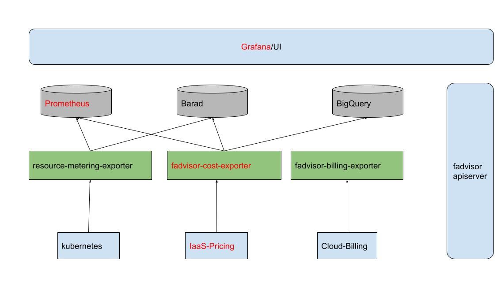

[TOC]

# Fadvisor: FinOps Advisor



---

fadvisor(finops advisor) is used to solve the `FinOps Observalibility`, it can be integrated with Crane to help users to improve the `cost visualization` and `optimization`. Also, it can be integrated with your monitoring system as a metric exporter.


fadvisor has a collection of exporters to collect metrics about cost and other finops metrics. 

 - `exporters` are used to collect metrics guided by `FinOps`.
   - now a cost-exporter is available, and other exporters can be integrated
 
# Concept
Fadvisor Cost model is a way to estimate and breakdown the resource price to each container or pod and other cloud native resource in kubernetes. Then, users can insight the costs by labels or other dimensions to view costs of what you care about.

This is an idea from `FinOps`, because the traditional billing and pricing system for cloud resource is not adaptive to cloud native resource.

Note Cost model now is just used to **estimate cost not to replace the billing**, because real billing depends on the billing system.

Model is an experimental implementation of the cost allocation and showback & chargeback from the FinOps.
	  
	1. The simplest cost model is to estimate a resource price of all nodes or pods by the same price.
	   for example, when compute costs, you can assume all container's cpu & ram unit price is the same, 2$ Core/Hour, 0.3$ Gib/Hour

	2. Advanced cost model is to estimate a resource price by cost breakdown.
	   this theory is based on each cloud machine instance is different price with different instance type and charge type.
	   so the containers in different node type or eks pod has different price

# Tutorial
Now there is a cost-exporter is available, which now support tencent cloud provider to collect the cloud instance pricing metrics.

## Deploy all components by one command
```
helm install fadvisor deploy/helm/fadvisor -n crane-system  --set cost-exporter.extraArgs.provider={cloud provider, now support qcloud} --set cost-exporter.extraArgs.secretid={{your cloud secret id}} --set cost-exporter.extraArgs.secretkey={{your cloud secret key}}
```
Except cost-exporter, it will install following components in your system by default.
```
dependencies:
  - name: kube-state-metrics
    condition: fadvisor.kube-state-metrics.enabled,kube-state-metrics.enabled
    repository: file://./charts/kube-state-metrics
  - name: node-exporter
    condition: fadvisor.node-exporter.enabled,node-exporter.enabled
    repository: file://./charts/node-exporter
  - name: prometheus
    condition: fadvisor.prometheus.enabled,prometheus.enabled
    repository: file://./charts/prometheus
  - name: grafana
    condition: fadvisor.grafana.enabled,grafana.enabled
    repository: file://./charts/grafana
```

install on local, it will use default config.

```
helm install fadvisor deploy/helm/fadvisor -n crane-system
```

## Install one by one

install cost-exporter, you must specify cloud provider and its secretid & secretkey; if you do not specify, it will use default pricing config.

```
helm install cost-exporter deploy/helm/fadvisor/charts/cost-exporter -n crane-system --set extraArgs.provider={cloud provider, now support qcloud} --set extraArgs.secretid={{your cloud secret id}} --set extraArgs.secretkey={{your cloud secret key}}
```

install other components
```
helm install kube-state-metrics deploy/helm/fadvisor/charts/kube-state-metrics -n crane-system
helm install node-exporter deploy/helm/fadvisor/charts/node-exporter -n crane-system
helm install prometheus deploy/helm/fadvisor/charts/prometheus -n crane-system
helm install grafana deploy/helm/fadvisor/charts/grafana -n crane-system
```


## Integrated with existing monitoring components
If you has an prometheus and grafana, you can just only deploy the exporter and do some configure.

You can deploy the cost-exporter to your tke cluster to collect the metric, use prometheus to scrape the metric, and following dashboards can be used;

### 1. deploy cost-exporter
#### install by helm
```
helm install cost-exporter deploy/helm/fadvisor/charts/cost-exporter -n crane-system --set extraArgs.provider={cloud provider, now support qcloud} --set extraArgs.secretid={{your cloud secret id}} --set extraArgs.secretkey={{your cloud secret key}}
```

#### install by kubectl
**NOTE**  you must specify your k8s secret id and secret key in yaml, this is used to access Tencent Cloud Cvm API.
```
kubectl create -f deploy/cost-exporter/ -n crane-system
```
the cost-exporter param has secretId and secretKey, you must provide your cloud provider secret
```
containers:
- name: fadvisor-cost-exporter
  image: docker.io/gocrane/fadvisor-cost-exporter:6927f01
  imagePullPolicy: IfNotPresent
  command:
    - /cost-exporter
    - --v=4
    - --provider=qcloud
    - --secretId=
    - --secretKey=
```

### 2. configure the prometheus scrape config and rules
configure following scrape target to your prometheus. 

```
- job_name: "fadvisor-cost-exporter"
    honor_timestamps: true
    scrape_interval: 5m
    scheme: http
    metrics_path: /metrics
    static_configs:
      - targets: ['cost-exporter.crane-system.svc.cluster.local:8081']
```
**NOTE**, except cost-exporter, your prometheus must have scraped the kubernetes metrics including:
 - `kubelet-cadvisor` metrics.
 - `node-exporter` metrics. need to install node-exporter.
 - `kube-state-metrics` metrics. need to install kube-state-metrics.


configure some recording rules to your prometheus.
```
recording_rules.yml:
  groups:
    - name: costs.rules
      interval: 3600s
      rules:
        - expr: |
            sum(label_replace(irate(container_cpu_usage_seconds_total{container!="POD", container!="",image!=""}[1h]), "node", "$1", "instance",  "(.*)")) by (container, pod, node, namespace) * on (node) group_left() avg(avg_over_time(node_cpu_hourly_cost[1h])) by (node)
          record: namespace:container_cpu_usage_costs_hourly:sum_rate
        - expr: |
            sum(label_replace(avg_over_time(container_memory_working_set_bytes{container!="POD",container!="",image!=""}[1h]), "node", "$1", "instance",  "(.*)")) by (container, pod, node, namespace) / 1024.0 / 1024.0 / 1024.0 * on (node) group_left() avg(avg_over_time(node_ram_hourly_cost[1h])) by (node)
          record: namespace:container_memory_usage_costs_hourly:sum_rate
        - expr: |
            avg(avg_over_time(node_cpu_hourly_cost[1h])) by (node)
          record: node:node_cpu_hourly_cost:avg
        - expr: |
            avg(avg_over_time(node_ram_hourly_cost[1h])) by (node)
          record: node:node_ram_hourly_cost:avg
        - expr: |
            avg(avg_over_time(node_total_hourly_cost[1h])) by (node)
          record: node:node_total_hourly_cost:avg

```

### 3. import following grafana dashboards to your grafana
and there are some available grafana dashboards for you if you has installed grafana already.
```
./deploy/helm/fadvisor/charts/grafana/dashboards/cluster-costs.json
./deploy/helm/fadvisor/charts/grafana/dashboards/costs-dimension.json
./deploy/helm/fadvisor/charts/grafana/dashboards/namespace-costs.json

```

#### estimated cluster costs


#### namespace costs 


#### topk container costs


# Dependency
 - kube-state-metrics
 - node-exporter
 - prometheus
 - grafana

