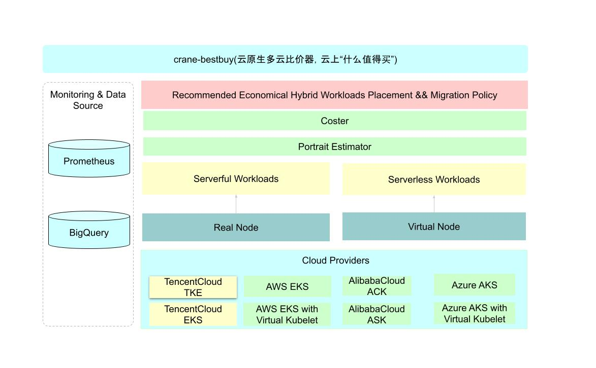
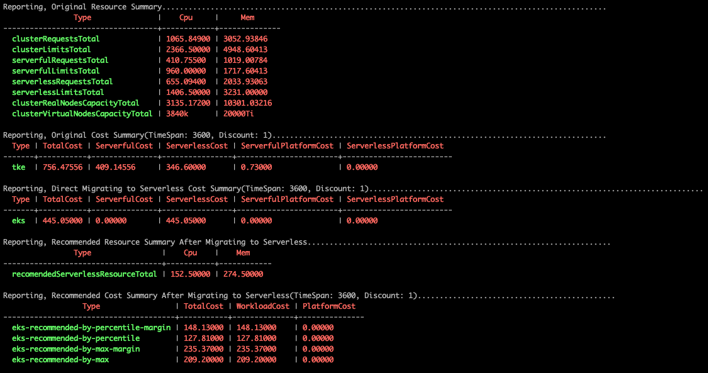
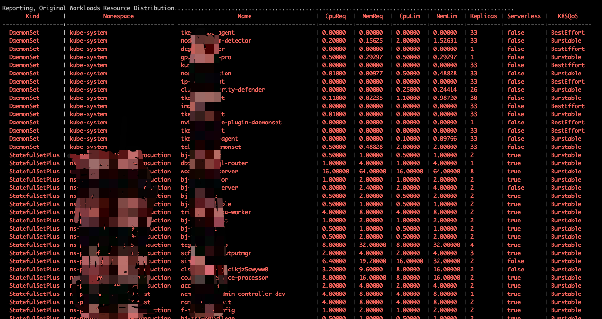
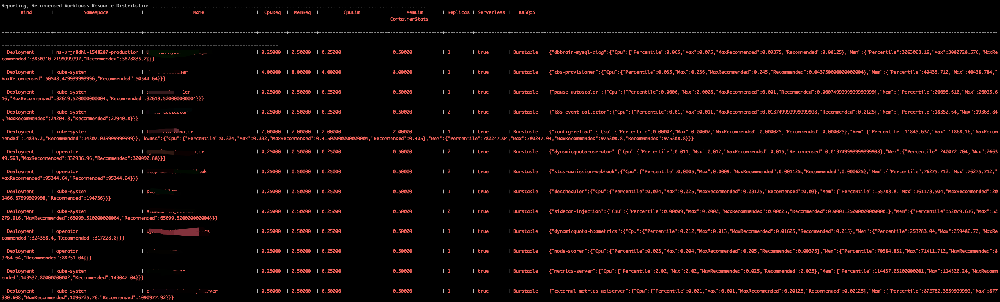

# Crane-Bestbuy



---

Comparator 是云原生多云比价器，能够自动识别平台的工作负载类型，划分为 serverless 和 serverful 工作负载，并生成推荐资源规格，最后给出合理的迁移策略和成本费用优化；

终极目标是成为一款 云上的电商比价系统，类似 bestbuy

## 使用教程

### 1. 构建

```
make fadvisor
```
### 2. 云厂商配置文件并确认秘钥权限

Prepare a cloud provider config file. now support tencent cloud. following is a qcloud config file named `qcloud-config.ini`
  
```
[credentials]
clusterId={your cluster id}
appId=app1
secretId={your cloud provider credential secret id}
secretKey={your cloud provider credential secret key}
[clientProfile]
defaultLimit=100
defaultLanguage=zh-CN
defaultTimeoutSeconds=10
region={your cluster region, such as ap-beijing、ap-shanghai、ap-guangzhou、ap-shenzhen and so on, you can find region name in your cloud provider console}
domainSuffix=internal.tencentcloudapi.com
scheme=
```
确保秘钥是有权限访问腾讯云cvm 以及 tke 平台api的。

### 3. 运行
Running the comparator. given `cluster-kubeconfig` and `qcloud-config.ini`
必须指定fadvisor的参数 `--comparator-mode=true` 进入比较器模式 
  
```bash
./bin/fadvisor --kubeconfig=cluster-kubeconfig --log_dir=/opt/logs/fadvisor --provider=qcloud --cloudConfigFile=qcloud-config.ini --comparator-mode=true --datasource=qm --comparator-cluster-id=cls-8d756ixr --comparator-cluster-name=cls-8d756ixr --logtostderr=false --comparator-analyze-history-length=72h
```

### 4. 报告

#### 费用对比




#### 工作负载资源对比

**迁移前资源规格**
  

 
**迁移后资源规格**
   


## 详细参数说明

| Parameter                                                  | Description                               | Default                                         |
|:-----------------------------------------------------------|:------------------------------------------|:------------------------------------------------|
| `comparator-mode`                                          | 比价器模式，使用比价器，必须开启         | false               |
| `datasource`                                               | 比价器获取数据的数据源,可以选择 `prom`，`qm` | `prom` |
| `comparator-cluster-id`                                    | 比价器分析的基线集群id（你当前用来运行比价器的集群），必填，否则生产的文件无法命名 | `default` |
| `comparator-cluster-name`                                  | 比价器分析的基线集群名（你当前用来运行比价器的集群） | `default` |
| `comparator-analyze-history-length`                        | 比价器分析的历史数据拉取时长 | `24h` |
| `comparator-analyze-end`                                   | 比价器分析历史数据的结束时间，即拉取数据的结束时间 | `默认取当前时间` |
| `comparator-analyze-step`                                  | 比价器分析历史数据的拉取步长，即拉取时序数据使用的步长，步长和时长会决定获取的时序点数和大小，会决定内存消耗，所以注意步长的调整| `5min` |
| `cloudConfigFile`                                          | 云厂商配置文件，如果选择云监控作为数据源，会复用该配置 | see [cloud credential config](#cloudCredentialConfig) |
| `prometheus-address`                                       | 如果选择Prometheus作为数据源，则需要填写Prometheus地址 | see [cloud credential config](#cloudCredentialConfig) |
| `prometheus-bratelimit`                                    | 如果选择Prometheus作为数据源，Prometheus的客户端是否开启限流 | `false` |
| `prometheus-timeout`                                       | 如果选择Prometheus作为数据源，Prometheus配置的请求超时时间 | `3min` |
| `prometheus-maxpoints`                                     | 如果选择Prometheus作为数据源，Prometheus最大拉取点数配置 | `11000` |
| `prometheus-federated-cluster-scope`                       | 如果选择Prometheus作为数据源，Prometheus是否是联邦数据源，可以拉取多个集群指标，如果你的Prometheus可以拉取多个集群的指标，则配置为true| `false` |
| `comparator-enable-container-ts-checkpoint`                | 是否允许比较器对拉取的容器时序数据做checkpoint 并保存，下次不需要重复拉取相同的数据| `false` |
| `comparator-enable-workload-ts`                            | 是否允许比较器拉取workload的时序数据，默认不会拉取| `false` |
| `comparator-enable-workload-ts-checkpoint`                 | 是否允许比较器对拉取的workload时序数据做checkpoint并保存，下次不需要重复拉取相同的数据| `false` |
| `comparator-data-path`                                     | 比较器数据保存路径, 默认保存在当前文件夹| `.` |


## 数据源
当前 crane-bestbuy 支持腾讯云监控和Prometheus监控作为数据源
### 腾讯云云监控
如果使用云监控作为数据源，云监控是云厂商服务，需要提供秘钥，秘钥配置直接复用前面的秘钥配置，另外指定如下参数：
```
./bin/fadvisor --kubeconfig=cluster-kubeconfig --log_dir=/opt/logs/fadvisor --provider=qcloud --cloudConfigFile=qcloud-config.ini --comparator-mode=true --datasource=qm --comparator-cluster-id=cls-8d756ixr --comparator-cluster-name=cls-8d756ixr --logtostderr=false --comparator-analyze-history-length=24h
```

### Prometheus
```
./bin/fadvisor --kubeconfig=cluster-kubeconfig --log_dir=/opt/logs/fadvisor --provider=qcloud --cloudConfigFile=qcloud-config.ini --comparator-mode=true --datasource=prom --prometheus-address=http://127.0.0.1:22222 --comparator-cluster-id=cls-8d756ixr --comparator-cluster-name=cls-8d756ixr --logtostderr=false --comparator-analyze-history-length=24h
```

#### 数据分析

比价器会可以根据需要生成一份表格时序数据，这份表格数据包含有工作负载分布和相关时序数据，通过 jupyter notebook 对这份数据进行探索分析，得到更多更加丰富的负载洞察和降本报告，注意数据大小和集群规模以及拉取时序数据时长有关，注意您机器的存储是否充足；
我们提供了一份 jupyter 分析模板，供你参考分析
